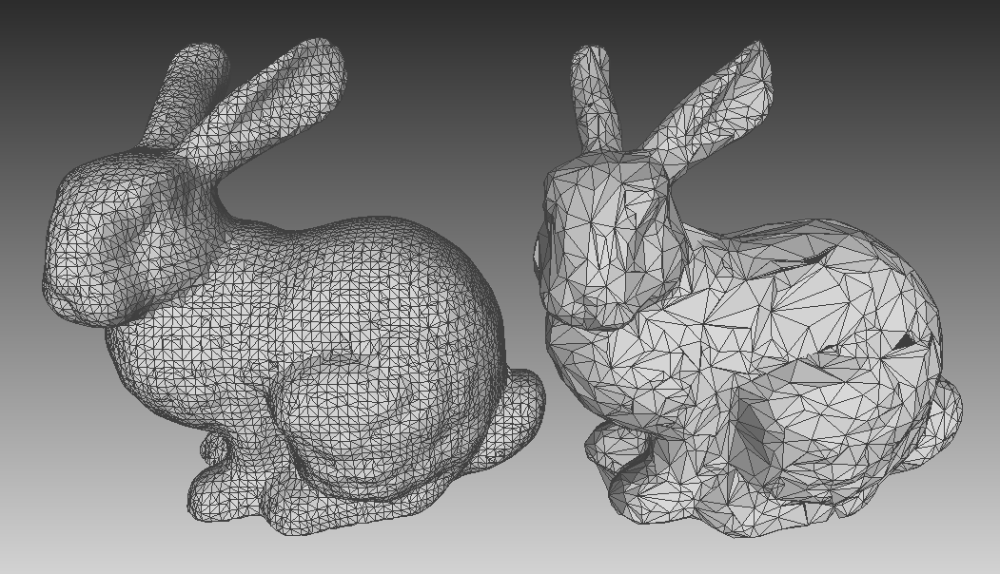

# Mesh simplification using quadric edge-collapse

This is a custom (and in progress) Python implementation of the well-known mesh simplification algorithm proposed by M. Garland & P. S. Heckbert in 1997. It is based on a quadric edge-collapse strategy, which iteratively contracts vertex pairs using quadrics to minimize the error with the original mesh.

  

This implementation tries to "keep things as simple as possible", limiting the use of third-party libraries. It is currently limited to triangular meshes and does not take the resulting mesh quality into account yet.

## Dependencies

The code is in `python` and relies only on `numpy` for the sake of simplicity.

## Going further

More details can be found in the original paper: Garland, M., & Heckbert, P. S. (1997). Surface Simplification Using Quadric Error Metrics. In *Proceedings of SIGGRAPH* (pp. 209-216). A digital copy of the paper is available [here](https://mgarland.org/files/papers/quadrics.pdf).

The algorithm has been the subject of numerous implementations. Some good ones can be found in MeshLab (and its Python library PyMeshLab), Open3D or CGAL - to name just a few.
